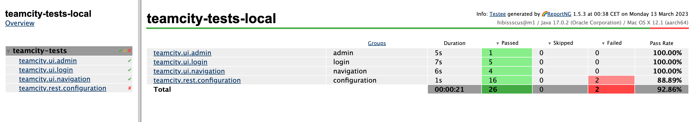

✅ **API and UI** test examples for [TeamCity](https://www.jetbrains.com/teamcity/)
=================================

Example of test results generated by 🌈 [ReportNG](https://github.com/hibissscus/reportng)

## Test scenarios

Here are some important scenarios that should be covered with a tests when using TeamCity:

🔄 **Continuous integration**: TeamCity should be able to automatically build, test, and deploy code changes to a testing environment every time new
code is committed to the repository.

🏗️ **Build configuration management**: TeamCity should allow developers to easily configure and manage build configurations, which specify the steps
required to build and test an application.

💥 **Build triggering**: TeamCity should provide flexible and customizable build triggering options, such as triggering builds on schedule, on code
changes, or on demand.

🌈 **Test reporting**: TeamCity should be able to generate detailed test reports, including test results, code coverage, and other relevant metrics.

🤝 **Integration with version control systems**: TeamCity should integrate with popular version control systems like Git, Subversion, and Mercurial,
allowing developers to easily manage and monitor changes to their codebase.

💾 **Artifact management**: TeamCity should allow developers to manage and store build artifacts, such as binaries and libraries, in a central
repository.

🕵️‍ **Build agents management**: TeamCity should allow administrators to manage build agents, which are the machines that perform the actual building
and testing of code.

🧩 **Extensibility & REST API**: TeamCity should be highly extensible, allowing developers to create custom plugins and integrations with other tools
and services.

🤖**Deployment automation**: TeamCity should provide integration with deployment automation tools, allowing developers to easily deploy their code
changes to production environments.

🚨**Notifications and alerts**: TeamCity should provide configurable notifications and alerts, allowing developers and administrators to stay informed
about build and deployment statuses, failures, and other important events.

## Important scenarios

Based on the importance and criticality of the scenarios, I would recommend testing the following three scenarios:

🔄 **Continuous integration**: The continuous integration scenario is critical to the success of the development process. Any failure in the CI process
can cause delays, impact the quality of the software, and potentially damage the team's reputation. Testing this scenario thoroughly will help ensure
that code changes are automatically built, tested, and deployed to a testing environment without any errors or issues.

🏗 **Build configuration management**: Build configuration management is also critical as it directly impacts the quality and consistency of the build
process. Testing this scenario will help ensure that build configurations are properly defined, maintained, and executed as expected. This will also
ensure that the build process is repeatable, predictable, and consistent across different environments and teams.

🧩 **Extensibility & REST API**: TeamCity REST API allowing developers to create custom plugins and integrations with other tools and services. This
API should be tested to be sure it's reliable for public use.

🌈 **Test reporting**: Test reporting is crucial for developers to understand the quality of the code changes they are making. Testing this scenario
will help ensure that test reports are accurate, comprehensive, and provide relevant insights into the application's performance, reliability, and
quality. This will also help identify issues early in the development process and enable developers to take corrective actions to improve the
software's quality.

## Basic project dependencies

- [Kotlin](https://kotlinlang.org/) a modern programming language that makes developers happier
- [Gradle](https://docs.gradle.org/current/userguide/userguide.html) as a project build tool
- [TestNG](https://testng.org/doc/) as a test framework
- [Selenide](https://selenide.org/documentation.html) for UI tests + [docker selenium](https://github.com/SeleniumHQ/docker-selenium)/seleniarm
- [Allure](https://docs.qameta.io/allure/)/[ReportNG](https://github.com/hibissscus/reportng) for test result reporting

## Getting Started

- SSH clone URL: git@github.com:hibissscus/teamcity-tests.git
- HTTPS clone URL: https://github.com/hibissscus/teamcity-tests.git

## How to run tests

1. `gradle` is used for building this `teamcity-tests` project
2. To run `UI` tests locally we need to install `chromedriver` or `geckodriver`
    - `brew install chromedriver` (or `brew upgrade chromedriver`)
    - `brew install geckodriver` (or `brew upgrade geckodriver`)
3. Go to `teamcity-tests/src/test/kotlin/teamcity` and run any of the test via IDEA with `test` profile (
   ex.: [ProjectTest](https://github.com/hibissscus/teamcity-tests/blob/master/src/test/kotlin/teamcity/rest/configuration/ProjectTest.kt))
   or via gradle:
    - ``./gradlew test --tests "teamcity.rest.configuration.ProjectTest"`` 
    - ``./gradlew test --tests "teamcity.ui.test.login.LoginTest"``
    - ``./gradlew test --tests "teamcity.ui.test.admin.AdminPageTest"``
    - ``./gradlew test --tests "teamcity.ui.test.navigation.NavigationTest"``
    - the whole test suite can be started via gradle locally:
      ``./gradlew test``
4. For `Selenium` dockerization [docker-compose.yml](https://github.com/hibissscus/teamcity-tests/blob/master/docker-compose.yml) file is used
    - test suite can be started via gradle using docker:
      ``./gradlew docker``
    - test result report link can be found in the terminal log 
    - `html` report can be opened via any browser 

### Authors

© 2023 [Sergei Stepanov](https://github.com/hibissscus) (Initial idea, implementation & enhancement)